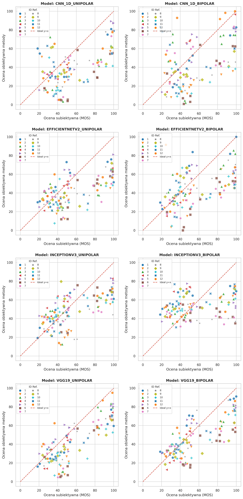
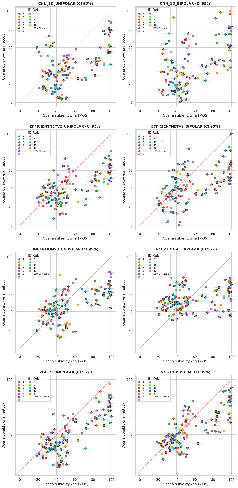
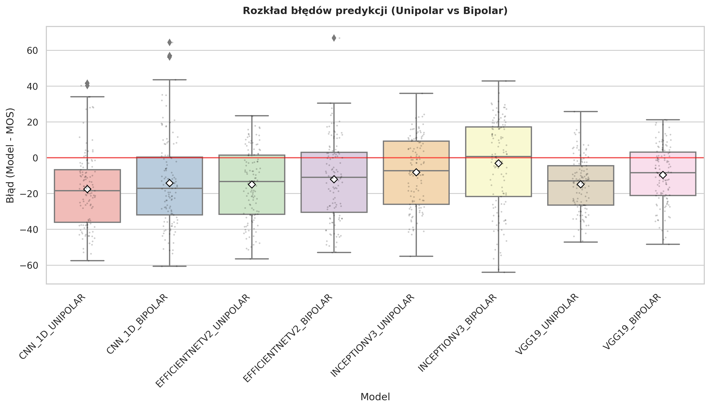
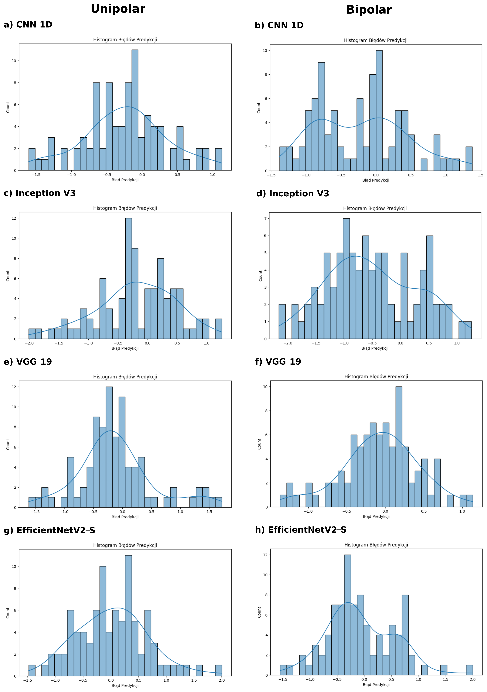
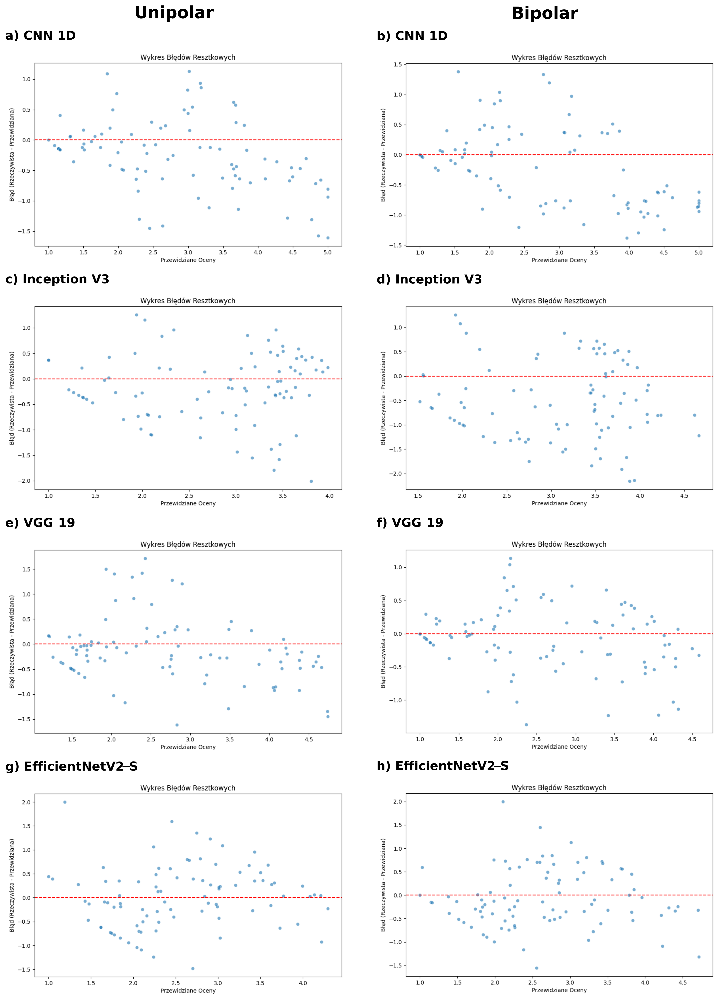

# Objective Audio Quality Assessment Application

Desktop application for audio quality evaluation using MATLAB algorithms (PEAQ, VisqolA) and PyTorch deep learning models.

## Overview

The application provides a three-stage workflow for assessing audio quality:
1. **Preprocessing** - Fragment selection and audio loading
2. **Subjective Assessment** - Manual audio playback and rating
3. **Objective Analysis** - Automated analysis using MATLAB and ML models

## Technology Stack

- **GUI Framework**: PyQt6 with dark_teal theme
- **Audio Processing**: librosa, scipy, soundfile, sounddevice
- **Deep Learning**: PyTorch 2.7, TorchVision 0.22
- **MATLAB Integration**: MATLAB Engine for Python 24.2
- **Database**: SQLite
- **Visualization**: pyqtgraph

## Installation

### Prerequisites
- Python 3.9+
- MATLAB R2024a or later with Engine for Python
- FFmpeg

### Steps

1. Clone the repository
```bash
git clone https://github.com/Tomaszlek/ObjectiveAudioQualityApplication.git
cd ObjectiveAudioQualityApplication
```

2. Create and activate virtual environment
```bash
python -m venv venv
venv\Scripts\activate  # Windows
# or
source venv/bin/activate  # Linux/macOS
```

3. Install dependencies
```bash
pip install -r requirements.txt
```

4. Run the application
```bash
python app/main.py
```

## Application Features

### Stage 1: Preprocessing (PreprocessingView)
- Load audio files with pyqtgraph waveform visualization
- Select audio fragments (7-second fixed duration)
- Linear region selection on waveform
- Fragment search via worker thread
- Audio playback with sounddevice

### Stage 2: Subjective Assessment (SubjectiveView)
- Display project data in table format
- Side-by-side audio playback (reference vs degraded)
- pyqtgraph waveform visualization for both channels
- Audio caching for performance
- Manual rating and notes

### Stage 3: Objective Analysis (ObjectiveView)
- Single file processing via SingleFileProcessorWorker
- Batch processing via AnalysisWorker
- MATLAB-based analysis (PEAQ, VisqolA)
- PyTorch model inference
- Results table display
- Context menu for file operations

## Audio Processing Pipeline

### AudioProcessor
- Loads audio using librosa (48 kHz mono)
- Signal alignment using cross-correlation
- Calls MATLAB functions:
  - `runVisqolForPair()` - VisqolA analysis
  - `PEAQTest()` - PEAQ analysis
- Temporary file cleanup

### PyTorchProcessor
Loads and runs 4 pre-trained CNN models:

| Model | File | Normalization | Input Size |
|-------|------|----------------|-----------|
| CNN 1D | cnn_1d_unipolared.pth | unipolar | 256×657 |
| InceptionV3 | inception_v3_unipolared.pth | unipolar | 299×299 |
| VGG19 | vgg19_bipolared.pth | bipolar | 224×224 |
| EfficientNet V2-S | efficientnet_v2_s_bipolared.pth | bipolar | 384×384 |

Features:
- Mel-spectrogram generation (2048 FFT, 256 hop length, 256 mel bins)
- Automatic GPU/CPU detection
- Model weight caching
- Unipolar [0, 1] and bipolar [-1, 1] normalization
- Batch inference support

## MATLAB Integration

### Configuration
Edit `app/config.ini`:
```ini
[MATLAB_PATHS]
peaq_root = matlab_scripts/PEAQ
visqol_root = matlab_scripts/VisqolA
pqeval_root = matlab_scripts/PEAQ/PQevalAudio
pqeval_cb = matlab_scripts/PEAQ/PQevalAudio/CB
pqeval_misc = matlab_scripts/PEAQ/PQevalAudio/Misc
pqeval_mov = matlab_scripts/PEAQ/PQevalAudio/MOV
pqeval_patt = matlab_scripts/PEAQ/PQevalAudio/Patt
```

### MATLAB Scripts
- `matlab_scripts/PEAQ/` - Perceptual Evaluation of Audio Quality algorithm
- `matlab_scripts/VisqolA/` - Google's Audio Quality metrics

## Database

SQLite database at `output/projekt.db` stores:
- `audio_pairs` table with fields:
  - `id`, `ref_path`, `deg_path`, `bitrate`, `noise_level`, `filter_cutoff`
  - `mos_lqo` (VisqolA score), `odg` (PEAQ ODG)
  - `user_rating`, `timestamp`

Operations via `DatabaseManager`:
- Load/save audio pairs
- Query results as pandas DataFrame
- Insert/update analysis results

## Project Structure

```
ObjectiveAudioQualityApplication/
├── app/
│   ├── main.py                    # Entry point, applies dark_teal theme
│   ├── config.ini                 # MATLAB paths configuration
│   ├── Controllers/
│   │   └── app_controller.py      # Orchestrates MATLAB engine, views, database
│   ├── Models/
│   │   ├── audio_processor.py     # MATLAB audio analysis interface
│   │   ├── pytorch_processor.py   # PyTorch model inference
│   │   ├── model_architecture.py  # 4 CNN model definitions
│   │   └── database_manager.py    # SQLite database operations
│   ├── Views/
│   │   ├── main_window.py         # Main UI (loads main_window.ui)
│   │   ├── preprocessing/         # Stage 1 preprocessing interface
│   │   ├── playback/              # Stage 2 subjective assessment interface
│   │   └── objective/             # Stage 3 objective analysis interface
│   ├── Services/
│   │   └── file_generation_service.py  # File export operations
│   ├── Workers/
│   │   ├── worker.py              # Base AnalysisWorker thread
│   │   ├── single_file_worker.py  # Single file analysis thread
│   │   └── find_fragment_worker.py # Fragment search thread
│   └── matlab_scripts/
│       ├── PEAQ/                  # PEAQ algorithm with subfolder structure
│       └── VisqolA/               # VisqolA algorithm
├── models/                        # Pre-trained PyTorch weights
│   ├── cnn_1d_unipolared.pth
│   ├── inception_v3_unipolared.pth
│   ├── vgg19_bipolared.pth
│   └── efficientnet_v2_s_bipolared.pth
├── training_notebook/             # Jupyter notebook for model training
│   └── w-asna-metoda-obiektywnej-oceny-jako-ci-d-wi-ku-u.ipynb
├── results/                       # Training analysis outputs
│   ├── 1_korelacje_podstawowe.png
│   ├── 2_korelacje_z_przedzialami.png
│   ├── 3_boxplot_bledow.png
│   ├── KOMPLET_Histogram_FINAL.png
│   ├── KOMPLET_Reszty_FINAL.png
│   └── tabela_wynikow.xlsx
├── output/                        # Application output directory (created at runtime)
├── .gitignore                     # Git ignore rules
├── requirements.txt               # Python dependencies
└── README.md                      # This file
```

## Model Architectures

### CNN 1D
- Input: 256×657 unipolar spectrogram
- 3 conv layers (kernel sizes: 11, 7, 3) with ReLU and MaxPool
- 3 fully connected layers (256→128→1)
- Output: Single quality score

### InceptionV3
- Input: 1-channel image → resized to 299×299
- Backbone: ImageNet pre-trained InceptionV3 (frozen)
- Custom head: 3 fully connected layers
- Unipolar normalization

### VGG19
- Input: 1-channel image → resized to 224×224
- Backbone: ImageNet pre-trained VGG19 features (frozen)
- Custom head: Flatten + 3 fully connected layers
- Bipolar normalization

### EfficientNet V2-S
- Input: 1-channel image → resized to 384×384
- Backbone: ImageNet pre-trained EfficientNet V2-S (frozen)
- Custom classifier: Flatten + 3 fully connected layers
- Bipolar normalization

## Jupyter Notebook

**File**: `training_notebook/w-asna-metoda-obiektywnej-oceny-jako-ci-d-wi-ku-u.ipynb`

Contains model training pipeline with:
- Dataset loading and preprocessing
- 4 CNN model architectures
- Training loop with early stopping
- Evaluation metrics (Pearson, Spearman, RMSE, MAE, R²)
- Visualization outputs (correlations, boxplots, histograms)
- Per-model results in Excel format

### Training Data Structure
- Notebook loads dataset splits from `train`, `validation`, and `test` folders.
- Spectrogram inputs are loaded from `.npy` files.
- Metadata rows include score labels and file references used for model training.
- Missing Visqol score labels are patched from a supplementary CSV file.
- Scores are normalized for training and denormalized for evaluation.
- Train/validation/test metadata is cleaned to remove missing labels and missing spectrogram files.

#### Data Structure Diagram

*Visual diagram of the dataset structure and training metadata flow.*

#### Data Structure Description
- `train`, `validation`, `test` folders contain spectrogram files and metadata.
- Metadata is read from CSV files and aligned with `.npy` spectrograms.
- The notebook normalizes quality labels for model training and reverts them for evaluation metrics.
- This structure supports both unipolar and bipolar model variants by keeping the same base data and applying normalization per model.

### Training Results and Visualizations
The notebook generates the following result files in `results/`:
- `1_korelacje_podstawowe.png`
- `2_korelacje_z_przedzialami.png`
- `3_boxplot_bledow.png`
- `KOMPLET_Histogram_FINAL.png`
- `KOMPLET_Reszty_FINAL.png`
- `tabela_wynikow.xlsx`

#### Result Plots


*Basic model correlation comparison.*


*Correlation values with interval analysis.*


*Error distribution by model.*


*Overall prediction error histogram.*


*Residual errors across model outputs.*

### Model Performance Table
| Model | PCC | SRCC | RMSE | MAE | R2 |
|---|---|---|---|---|---|
| VGG19_BIPOLAR | 0.764818 | 0.743902 | 18.825633 | 14.903445 | 0.439739 |
| VGG19_UNIPOLAR | 0.806365 | 0.730046 | 21.041829 | 17.341527 | 0.300064 |
| INCEPTIONV3_UNIPOLAR | 0.641237 | 0.640784 | 20.966491 | 17.249812 | 0.305067 |
| EFFICIENTNETV2_UNIPOLAR | 0.626718 | 0.600132 | 24.659271 | 20.000555 | 0.038716 |
| EFFICIENTNETV2_BIPOLAR | 0.532801 | 0.565919 | 25.149103 | 20.213516 | 0.000147 |
| CNN_1D_UNIPOLAR | 0.593323 | 0.504310 | 27.435965 | 23.039550 | -0.189959 |
| CNN_1D_BIPOLAR | 0.504015 | 0.440341 | 28.669074 | 24.214745 | -0.299328 |
| INCEPTIONV3_BIPOLAR | 0.250210 | 0.251349 | 25.116861 | 20.665372 | 0.002709 |

### Result Summary
- `VGG19_UNIPOLAR` achieved the highest Pearson correlation.
- `VGG19_BIPOLAR` achieved the lowest RMSE and best R2.
- `INCEPTIONV3` performs better in the unipolar variant than bipolar.
- `EFFICIENTNETV2` also performs better in the unipolar variant.
- `CNN_1D` models have the highest errors and negative R2 values in these results.

To run:
```bash
pip install jupyter
jupyter notebook training_notebook/
```

## Usage Workflow

1. **Launch Application**
   ```bash
   python app/main.py
   ```
   MATLAB engine starts automatically (may take several seconds)

2. **Preprocessing Stage**
   - Load audio files
   - Select 7-second fragments
   - Preview waveforms

3. **Subjective Stage**
   - Play reference and degraded audio
   - Provide manual quality ratings

4. **Objective Stage**
   - Run MATLAB analysis (PEAQ + VisqolA)
   - Run selected PyTorch models
   - View results in table
   - Export to database

5. **Review Results**
   - Access `output/projekt.db`
   - Export to CSV via DatabaseManager

## Results

- `output/projekt.db` stores analyzed audio pairs and objective metrics.
- `results/` contains model training outputs generated by the notebook:
  - `1_korelacje_podstawowe.png`
  - `2_korelacje_z_przedzialami.png`
  - `3_boxplot_bledow.png`
  - `KOMPLET_Histogram_FINAL.png`
  - `KOMPLET_Reszty_FINAL.png`
  - `tabela_wynikow.xlsx`
- `tabela_wynikow.xlsx` contains 8 model variants with metrics:
  - **VGG19_UNIPOLAR** achieved the highest Pearson correlation (PCC ≈ 0.806)
  - **VGG19_BIPOLAR** achieved the lowest RMSE (≈ 18.83)
  - Models include unipolar and bipolar variants of VGG19, InceptionV3, EfficientNetV2, and CNN 1D
- Training notebook evaluates model performance and exports per-model metrics and visualizations.

## Performance Notes

- Audio normalization: subsecond for 10s audio
- Signal alignment (cross-correlation): ~1-2s
- MATLAB PEAQ analysis: ~5-8s per pair
- PyTorch inference (all 4 models): GPU accelerated
- UI updates via worker threads to prevent freezing

## Dependencies

Key packages from `requirements.txt`:
- PyQt6 (GUI)
- PyTorch + TorchVision (ML models)
- librosa (audio processing)
- scipy (signal processing)
- soundfile + sounddevice (audio I/O)
- matlabengine (MATLAB integration)
- pandas (data management)
- pyqtgraph (visualization)

## References

### Neural Network Architectures
- CNN 1D: Convolutional Neural Networks for Time Series Classification (Fawaz et al., 2019)
- InceptionV3: Rethinking the Inception Architecture for Computer Vision (Szegedy et al., 2016)
- VGG19: Very Deep Convolutional Networks for Large-Scale Image Recognition (Simonyan & Zisserman, 2015)
- EfficientNet V2: EfficientNetV2: Smaller Models and Faster Training (Tan & Le, 2021)
- Adam Optimizer: Adam: A Method for Stochastic Optimization (Kingma & Ba, 2015)

### Audio Quality Assessment Algorithms
- PEAQ: PEAQ — the ITU standard for objective measurement of perceived audio quality (Thiede et al., 2000)
- PEAQ ITU Standard: Recommendation ITU-R BS.1387-2 - Method for objective measurements of perceived audio quality (ITU-R, 2023)
- VISQOL: ViSQOL: an objective speech quality model (Hines et al., 2015)
- ViSQOL v3: ViSQOL v3: An Open Source Production Ready Objective Speech and Audio Metric (Chinen et al., 2020)
- ViSQOLAudio: Objective Assessment of Perceptual Audio Quality Using ViSQOLAudio (Sloan et al., 2017)
- PEMO-Q: PEMO-Q—A New Method for Objective Audio Quality Assessment Using a Model of Auditory Perception (Huber & Kollmeier, 2006)

### Related Research
- Kasperuk & Zieliński (2022): Non-intrusive method for audio quality assessment of lossy-compressed music recordings using convolutional neural networks. International Journal of Electronics and Telecommunications, vol. 68, no. 4.
- Mumtaz et al. (2022): Nonintrusive Perceptual Audio Quality Assessment for User-Generated Content Using Deep Learning. IEEE Transactions on Industrial Informatics, vol. 18, pp. 7780-7789.
- Delgado & Herre (2020): Can we still use PEAQ? A Performance Analysis of the ITU Standard for the Objective Assessment of Perceived Audio Quality. In Twelfth International Conference on Quality of Multimedia Experience (QoMEX), Athlone.
- EBU R128: R 128 - Loudness normalization and permitted maximum level of audio signals (EBU, 2023).
- WebMUSHRA: webMUSHRA — A Comprehensive Framework for Web-based Listening Tests (Schoeffler et al., 2018).
